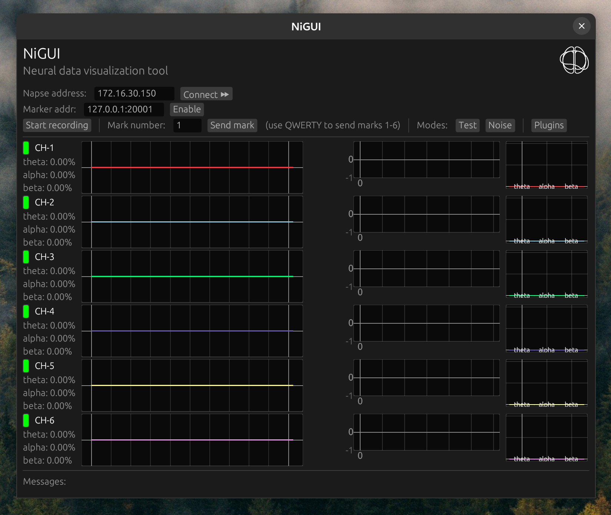

<h1>NiGUI: Real-time 🧠 Data Visualizer  </h1>

NiGUI is the real-time EEG data visualization GUI for the [NAPSE](https://github.com/hirikilabs/NapseFirmware) device developed by the [NIT Team](https://www.neuralinterfacetechnologies.com/).

<center>
    
</center>

> **⚠️ NOTE:** NiGUI is in an early development stage, expect bugs and breaking changes. Reporting issues and contributions are welcome.

## Building ⚙️

NiGUI is written in the Rust programming language ⚡, thus, the first step is to set up an up-to-date working rust toolchain.

Once you have rust ready to be used, as NiGUI is based on the excellent [`egui`](https://github.com/emilk/egui) crate, check if you have egui's dependecies met. In a Linux system based on Debian the following command should install all the nescessary packages for egui to work:

```bash
sudo apt-get install libxcb-render0-dev libxcb-shape0-dev libxcb-xfixes0-dev libxkbcommon-dev libssl-dev
```

If `egui`'s dependencies are installed and a working rust toolchain is set up, you should be able to build NiGUI by running `cargo run --release` (the `--release` flag is important, as activates compiler optimizations).

If you find any problem during the building process, please fill an issue describing the problem.

## License

NiGUI is distributed under the terms of the GLPv3 license. See [LICENSE](./LICENSE) for more details.
